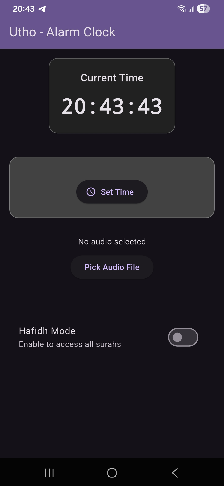
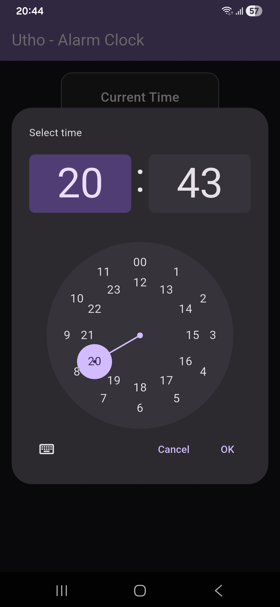
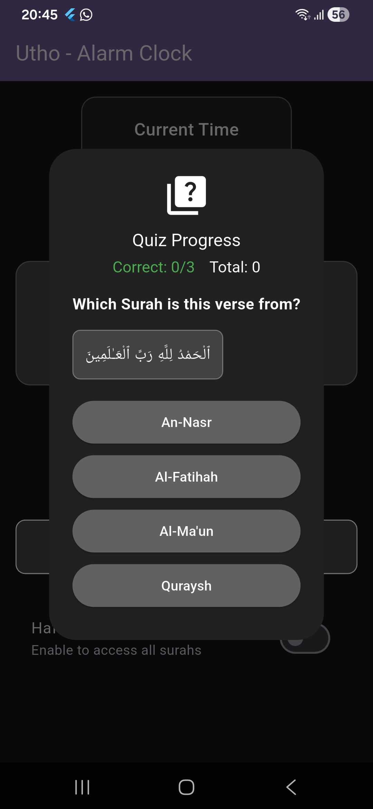

# Utho - Alarm Clock with Quranic Quiz

Instead of mindless snoozing, challenge your mind with Islamic knowledge to start your day with purpose and cognitive stimulation.

## Features

- **Cognitive Awakening**: Force yourself to wake up as you try to remember ayahs from the Quran
- **Islamic Education**: Learn and memorize surahs while waking up
- **Hafidh Mode**: If you don't know all 114 surahs turn off the Hafidh mode to only get ayahs from the surahs with 10 ayahs or fewer
- **Custom Ringtones**: Personalize your wake-up experience with chosen audio
- **Cross-Platform**: Works on Android and Linux
- **Dark Theme**: Gentle on the eyes during early mornings
- **Reliable Scheduling**: Smart notifications that work around battery optimizations

## Screenshots

### Main Interface



### Setting an Alarm



### Quran Quiz



## Releases

Download the latest version from the [Releases](https://github.com/AsifJishan/Utho---Alarm-Clock-with-Quran-Quiz/releases) page.

**Latest Version**: v1.0.0

- ✅ Android APK available
- 🔄 iOS version in development
- ✅ Linux desktop support

### Prerequisites

- Flutter SDK (version 3.0.0 or higher)
- Dart SDK
- Android Studio or VS Code with Flutter extensions
- For Android: Android SDK with API level 21 or higher
- For iOS: macOS with Xcode

### Setup

1. Clone the repository:

   ```bash
   git clone https://github.com/AsifJishan/Utho---Alarm-Clock-with-Quran-Quiz.git
   cd Utho---Alarm-Clock-with-Quran-Quiz
   ```

2. Install dependencies:

   ```bash
   flutter pub get
   ```

3. Run the app:

   ```bash
   flutter run
   ```

## Download & Install

### For Android Users (Easy Install)

1. **Download the APK**: Visit the [Releases](https://github.com/AsifJishan/Utho---Alarm-Clock-with-Quran-Quiz/releases) page and download the latest `utho-release.apk` file

2. **Enable Unknown Sources** (if not already enabled):
   - Go to Settings → Apps → Special app access → Install unknown apps
   - Find your browser app and enable "Allow from this source"

3. **Install the App**:
   - Open the downloaded APK file
   - Tap "Install" when prompted
   - Wait for installation to complete

4. **Grant Permissions**:
   - Open the app
   - Allow notification permissions when asked
   - Go to Setting → Apps → Utho and grant all required permission
   - Grant storage permissions for custom ringtones

### For iOS Users

iOS version coming soon! For now, you'll need to build from source on a Mac with Xcode.

### For Linux Users

The app includes Linux support. To run on Linux:

```bash
flutter build linux
./build/linux/x64/release/bundle/utho
```

## Usage

1. **Set an Alarm**:
   - Tap "Set Time" to choose your wake-up time
   - Select "Set Alarm" to schedule it

2. **Choose a Ringtone**:
   - Tap "Pick Audio File" to select a custom ringtone from your device

3. **Hafidh Mode**:
   - Toggle "Hafidh Mode" to access all Quran surahs for quiz questions

4. **Alarm Dismissal**:
   - When the alarm rings, guess which surahs the ayahs are from to turn it off
   - Get 3 correct answers to successfully dismiss the alarm

## Architecture

- **MVVM Pattern**: Clean separation of concerns with ViewModels
- **Provider**: State management for reactive UI updates
- **Service Layer**: Handles alarm scheduling, audio playback, and API calls
- **Repository Pattern**: Data persistence with SharedPreferences

## Technologies Used

- **Flutter**: Cross-platform UI framework
- **Dart**: Programming language
- **audioplayers**: Audio playback
- **awesome_notifications**: Local notifications
- **http**: API communication
- **shared_preferences**: Local data storage
- **permission_handler**: Runtime permissions
- **file_picker**: File selection

## API

The app uses the [Quran-Quiz API](https://quran.zakiego.com/) to fetch quiz questions.

## Contributing

Contributions are welcome! Please feel free to submit a Pull Request.

1. Fork the project
2. Create your feature branch (`git checkout -b feature/AmazingFeature`)
3. Commit your changes (`git commit -m 'Add some AmazingFeature'`)
4. Push to the branch (`git push origin feature/AmazingFeature`)
5. Open a Pull Request

## License

This project is licensed under the MIT License - see the [LICENSE](LICENSE) file for details.

## Acknowledgments

- Quran API provided by [zakiego](https://github.com/zakiego)
- Flutter community for excellent documentation and packages
- Islamic scholars for making Quran education accessible

## Support

If you find this app helpful, please consider:

- ⭐ Starring the repository
- 📢 Sharing with friends
- 🐛 Reporting bugs or suggesting features

---

Made with ❤️ for the Muslim community
